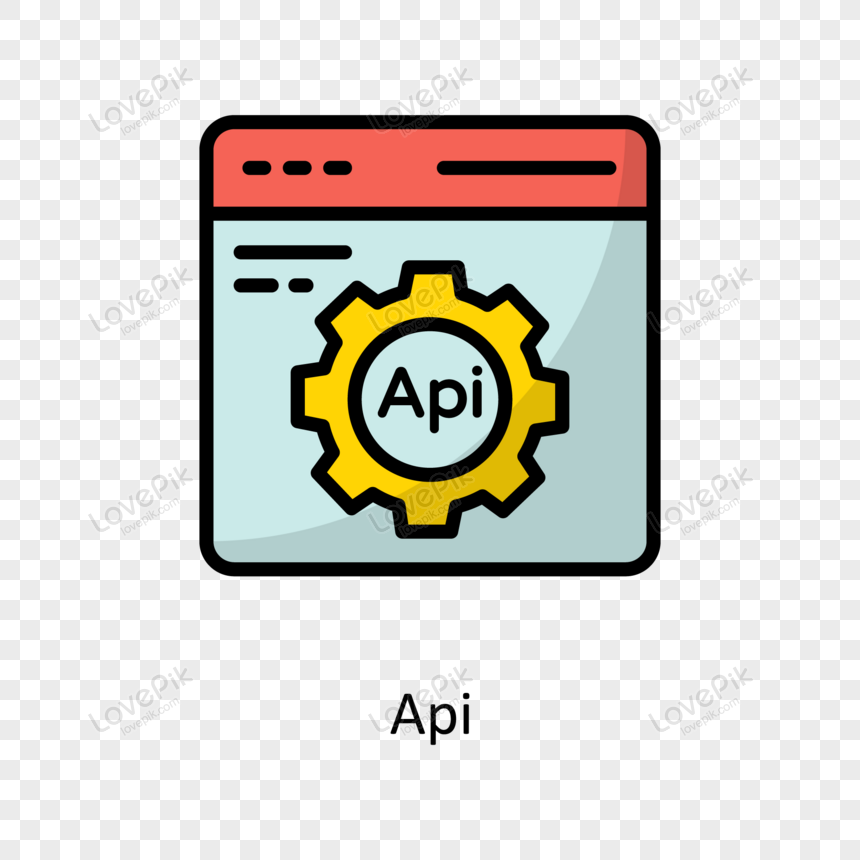
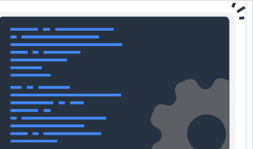

# Quest Javascript Avançado - Consumo de API do GitHub - Fetch nos Perfis

Quest (Desafio) de JavaScript Avançado para praticar o que aprendi na extensão universitária Dev Full Stack DevEmDobro até o presente momento.

## Recursos

Este projeto foi iniciado como exercício em uma das aulas, onde a partir de um git clone feito no repositório dos monitores do DevQuest, ('https://github.com/devemdobro/projeto-inicial-fetch-github-api'), baixamos um arquivo que tinha tudo preparado para o início da implementação JavaScript, e na primeira parte do exercício, implementamos o projeto mencionado com um consumo de API do GitHub onde buscamos os Perfis das pessoas no GitHub entrando com o nome de usuário dela. E tínhamos como resposta, o nome, a descrição da Bio, e os repositórios.
A partir da segunda parte, que era a Quest em si, foi simulado um ambiente de escriório de desenvolvimento, onde o chefe pede as seguintes implementaçãoes:

<h2>Além de trazer o que já estava implementado, a saber:</h2>
<ul>
    <li>A imagem do usuário</li>
    <li>Nome completo do usuário</li>
    <li>Login do usuário</li>
    <li>Bio do usuário do usuário</li>
    <li>Nome dos  repositórios do usuário</li>
    <li>Links para ir direto aos repositórios apresentados</li>
</ul>

<h2>As seguintes implementações deveriam ser feitas:</h2>
<ul>
    <li>Trazer o número de seguidores do usuário</li>
    <li>Trazer o número de pessoas que o usuário está seguindo</li>
    <li>Trazer os 10 últimos eventos desse usuário</li>
    <li>Para cada evento que veio com o Fetch, apresentar o nome do repositório em que foi feito o evento, e o nome do commit, o que foi feito no evento</li>
    <li>Quantidade de Forks feitas no repositório em questão</li>
    <li>Quantidade de estrelas dadas ao repositório</li>
    <li>Quantidade de pessoas que estão visualizando, watchers, o repositório</li>
    <li>Qual principal linguagem de programação foi usada no repositório em questão</li>
</ul> 

## Tecnologias utilizadas

- HTML 
- CSS 
- Fetch 
- Consumo de API 
- JavaScript 

## Inicialização

Não há necessidade de nennhum npm ao fazer o git.clone.

## Colaboradores

- Exercício de HTML CSS avançado na extensão universitária Full Stack Developer DevEmDobro https://www.instagram.com/devemdobro/;
- Levando a sério para me tornar cada dia melhor.  
 https://github.com/IsaiasLourenco 
 https://www.linkedin.com/in/isaias-louren%C3%A7o/

